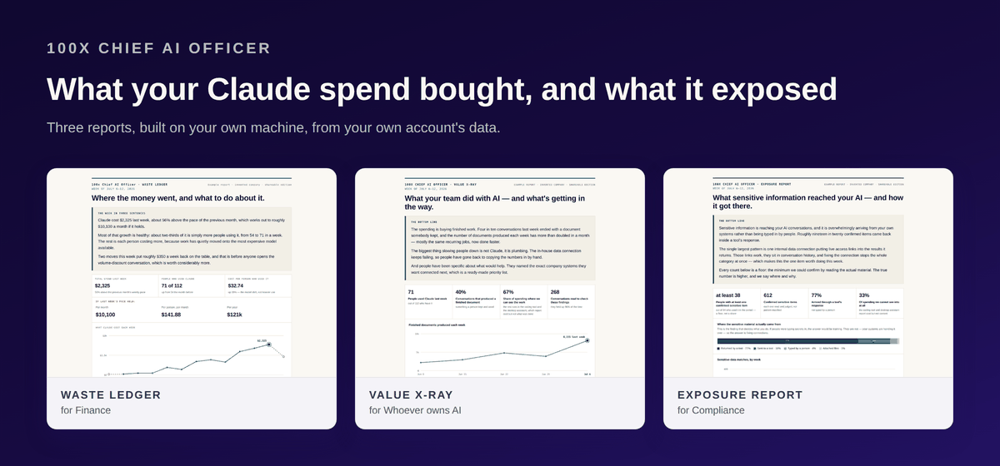
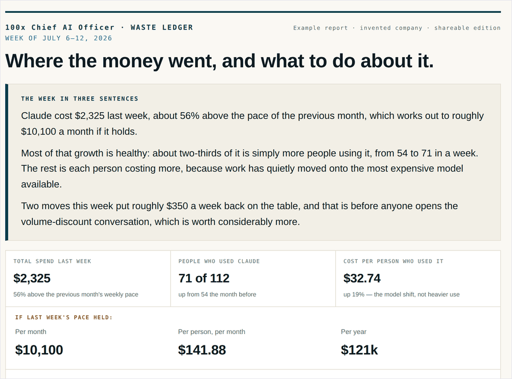
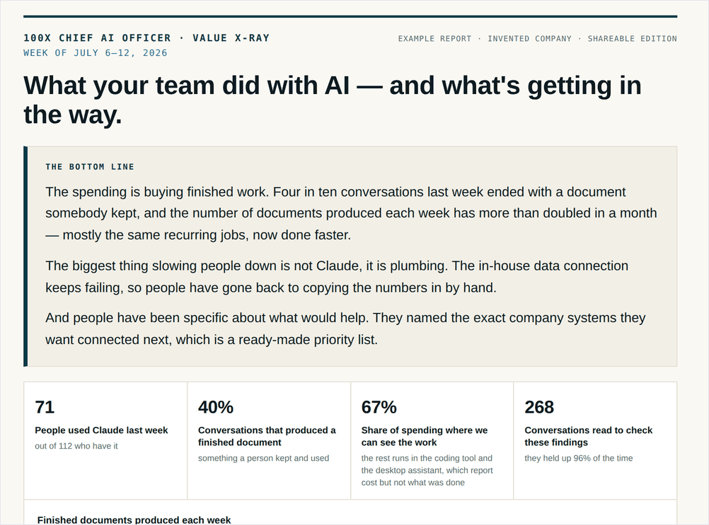
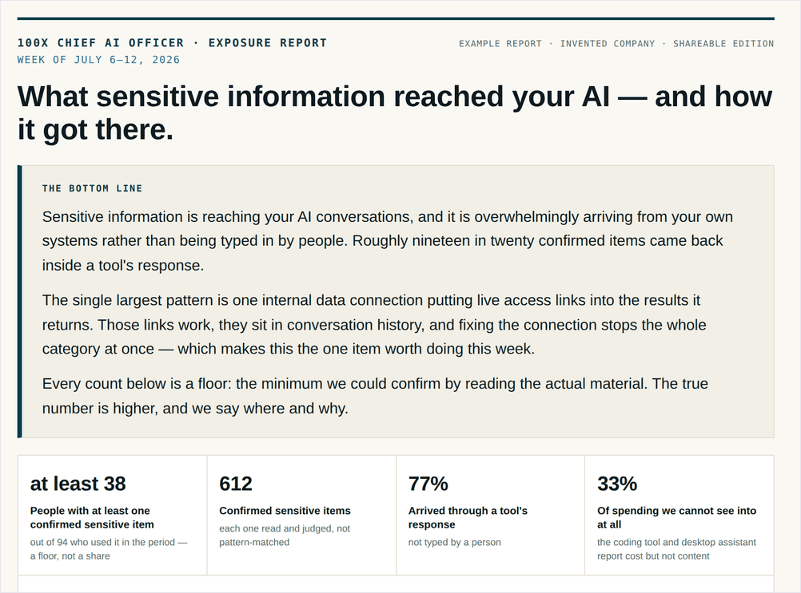
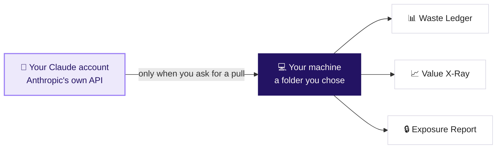

<a href="https://100xteam.ai/">
  <picture>
    <source media="(prefers-color-scheme: dark)" srcset="docs/assets/100xteam-logo-dark.png">
    
  </picture>
</a>

<h3></h3>

# 100x Chief AI Officer

> Built by 100x — [100xteam.ai](https://100xteam.ai)

[](https://github.com/100xopensource/chief-ai-officer/actions/workflows/ci.yml)
[](https://github.com/100xopensource/chief-ai-officer/actions/workflows/scrub.yml)
[](LICENSE)

**AI spend reporting for the person who has to answer for it — in Claude Cowork
or Claude Code.**

Your firm pays for Claude every month. This turns your own account's usage
records into three reports: what that money bought, where it was wasted, and
whether anything sensitive went into it. You ask in plain English; the plugin
runs everything on your own machine and writes the reports to a folder you
choose.



## What it produces

| Output | Purpose |
|---|---|
|  | **Waste Ledger** — for **Finance and Procurement.** What Claude cost, which of that bought nothing, and what to say at renewal. |
|  | **Value X-Ray** — for **whoever owns AI.** What the money actually bought, and what is stopping it buying more. |
|  | **Exposure Report** — for **Compliance and Risk.** Whether client data, credentials or MNPI reached Claude, and how it got there. |

Each report is a single web page. Double-click it to open it, or attach it to an
email. No dashboard to log into, no server to run, no vendor to sign up with.

Every name and number in those examples is invented. To click through a finished
one, download a file from [`docs/mock-reports/`](docs/mock-reports/) and open it
in your browser — GitHub shows you a page's source code rather than the page
itself, so downloading is the trick.

## Before you start

1. **Claude Cowork, or Claude Code.** Either one. The plugin is the same.
2. **A browser**, to open the reports.
3. **Nothing to install.** Python is already on your machine, and the first run
   needs no API key, no permission from anyone, and touches no real data.

Your own firm's numbers come later, and need one API key from whoever
administers your Claude account. See [Run it on your own data](#run-it-on-your-own-data).

## Install

### In Claude Cowork

1. Open Claude Cowork.
2. Select **Customize → Plugins**.
3. Select **Add**, then **Add marketplace**.
4. Paste `https://github.com/100xopensource/chief-ai-officer`.
5. Pick **100x Chief AI Officer** from the list and install it.
6. **Start a new conversation.** See below — this step is not optional.

### In Claude Code

```
/plugin marketplace add 100xopensource/chief-ai-officer
/plugin install 100x-chief-ai-officer@100x-chief-ai-officer
```

Then **start a new conversation.**

> **Why starting a new conversation matters.** A plugin installed part-way
> through a session isn't picked up until a new one begins: the skills won't
> appear and the plugin list comes back empty, even though every file is already
> on disk. It looks exactly like a failed install. It isn't one, and reinstalling
> won't help.

When the new conversation opens, the plugin introduces itself — what it is, the
fact that it hasn't read anything yet, and what you can do next.

## See it on a fictional company first

Do this before pointing it at anything real. Start a new chat and say:

> **"Show me an example Chief AI Officer report."**

Claude invents a fictional 112-person company — 14 weeks of history, about
$11,700 of pretend spend, 900 conversations, all fabricated on your own machine
— and builds all three reports from it. Then it tells you where they are. Open
any of them in your browser.

No API key, no permission from anyone, and no real data involved.

## Run it on your own data

### 1. Get a key

You need **one API key** from whoever administers your firm's Claude account.
You almost certainly cannot create it yourself — it comes out of the Claude
admin console, and only an account owner or admin can make one.

| The key they give you | What you get |
|---|---|
| A **Compliance API key** | All three reports |
| An **Admin API key** | The Waste Ledger and the Value X-Ray |

**One key is usually all there is, and it is usually enough.** A Compliance key
covers the cost and usage pulls as well as the conversation pull. If you are
given an Admin key only, you still get two of the three reports, and the third
one reports itself as unbuildable with the reason — nothing silently breaks.

<details>
<summary><b>An email you can send your Claude administrator</b> — copy, paste, fill in the blanks</summary>

<br>

> Hi — I'm setting up internal cost and governance reporting on our Claude
> Enterprise account, using an open-source tool that runs entirely on my machine
> and doesn't send our data anywhere ([link](https://github.com/100xopensource/chief-ai-officer)).
>
> Could you create and send me an API key for it? Either works:
>
> - a **Compliance API key**, which covers all three reports, or
> - an **Admin API key**, which covers the two cost reports — read-only totals,
>   no conversation content.
>
> Please send it over [1Password / our secrets manager] rather than email or
> chat, since it's a live credential.
>
> Thanks — happy to walk you through what the tool does first if useful.

</details>

> **Treat a Compliance key like production database credentials,** because that
> is effectively what it is. It can read what people wrote. An Admin key cannot —
> it returns dollars, token counts and per-person usage totals only.

### 2. Say so

Start a new chat and say:

> **"Set up Chief AI Officer with my API key."**

Claude asks where to put the key, checks what it can reach, and tells you which
reports your account can produce before pulling anything. Downloading is always
a separate, named step — asking for a report never triggers a network call you
didn't ask for.

### 3. Ask for the reports

> **"Build this week's Chief AI Officer reports."**

The first pull fetches your history and takes a few minutes; later runs only
fetch what's new and take seconds. **Ask for this every Monday morning and you
have a standing weekly reporting pack.**

### 4. Send one to someone

> **"Package the Exposure Report for our Head of Compliance."**

You get a folder that's ready to send, containing the report, the data it was
built from, a cover note written to be pasted into an email unedited, a list of
every check the report passed, and checksums so the recipient can prove the file
wasn't altered.

If a report fails any of its safety checks, **nothing is packaged, and there is
no override flag.** A report you had to switch off a privacy check to send isn't
a report.

## What you can ask for

You never have to remember a command. Ask in plain English and the right skill
runs it for you.

| Say something like | What happens |
|---|---|
| 🩺 &nbsp;"Set this up" / "Is my setup right?" | Checks what's installed, what data you have, and which reports it can build |
| 📄 &nbsp;"Show me an example report" | Invents a fictional company and builds all three |
| 📊 &nbsp;"Build this week's reports" | Pulls what's new and writes the three reports |
| 📦 &nbsp;"Package the exposure report for Legal" | A folder ready to send, with a cover note and checksums |
| 🔍 &nbsp;"Help me review these flagged passages" | Walks you through judging what the scan found |
| 🧾 &nbsp;"Where did this number come from?" | Explains a figure in plain language, down to the source |

## Where your data goes

Nowhere you didn't send it. Your usage records come from Anthropic's own API to a
folder you chose, the analysis happens there, and the reports are written next to
it. There is no telemetry, no phone-home, and no 100x server anywhere in the path.



Exactly two places in the code make an outbound call, and you can check both
yourself: `pipeline/fetch/` downloads your own account's data, and
`pipeline/judges/anthropic.py` runs **only** if you pick the model reader for the
Exposure Report. Choose a person with a worksheet instead and the whole thing
makes no network calls at all.

## Before it reads anyone's conversations

The Waste Ledger and the Value X-Ray work on dollars and counts. The Exposure
Report has to read what your colleagues actually typed into Claude, and what the
tools they connected sent back. In a financial firm that can include client
records, deal terms, material nonpublic information, and live credentials.

**It will not touch that data until you've said yes on the record.** The first
time you ask, it stops, explains exactly what will be stored and where, and asks
for the name of the person accountable for the decision. That answer is saved
next to the data.

> In six months, when somebody asks *"who decided we'd start reading this?"*,
> there is an answer with a name and a date on it.

Then comes the rule the whole report is built on:


You choose who does that reading: a person working through a worksheet, with no
network calls at all, or a Claude model.

**→ Full walkthrough: [the Exposure Report](docs/EXPOSURE_REPORT.md).**

## Prefer the command line?

Everything above is also a CLI, and the plugin is running that CLI for you. If
you'd rather drive it yourself:

```bash
git clone https://github.com/100xopensource/chief-ai-officer.git
cd chief-ai-officer
pip install -e .

caio demo --out data-demo                              # invent a company
caio all  --data-dir data-demo --out-dir _reports      # build all three reports
```

Then open any file in `_reports`.

Reports built from an existing folder of data need **nothing installed at all** —
the demo, the gap check, the metrics, the scan and the report gates are standard
library only. `pip install -r requirements.txt` adds `requests`, which is needed
the first time you pull your own account's data.

**→ Every command, the six stages, and running without installing:
[the command reference](docs/REFERENCE.md).**

## When something goes wrong

Three problems account for most of it:

| | What you see | What it means | Fix |
|---|---|---|---|
| **1** | The skills don't appear, or the plugin list is empty | It was installed part-way through a session | **Start a new conversation.** Nothing is broken and reinstalling won't help. |
| **2** | `No module named 'requests'` on your first real pull | Downloading needs one library; building reports doesn't | `pip install requests` |
| **3** | An emailed report opens as a blank white page | The page draws itself when a browser opens it; a preview pane doesn't | Save the attachment and open it in a **browser**. Send reports as attachments, never pasted into an email body. |

<details>
<summary><b>Everything else</b> — keys, blocked reports, dashes where numbers should be</summary>

<br>

| What you see | What it means | Fix |
|---|---|---|
| Nothing happened at all after installing | The greeting only speaks once per machine | Ask "what is Chief AI Officer?" — it will introduce itself. |
| `401` or `403` from the API | The key is wrong, expired, or revoked | Check it was pasted whole. An Admin key cannot read conversation content — for the Exposure Report you need a Compliance key. |
| A report is listed as blocked, not built | It failed one of the publication gates | The message names the gate. This is the tool working correctly — fix the cause, don't look for an override. |
| "too new to compare" all over a report | Your data doesn't go back far enough yet | Normal in the first week or two. Keep pulling; comparisons appear once there's history. |
| A figure reads `—` or "cannot be measured" | The data doesn't carry what that figure needs | Deliberate, and it must not be read as zero. The report names the reason. |
| `command not found: caio` | You're using the CLI without having installed it | `pip install -e .` from a checkout — or just ask Claude instead, which doesn't need it. |

</details>

Still stuck? Open an issue at
[github.com/100xopensource/chief-ai-officer/issues](https://github.com/100xopensource/chief-ai-officer/issues).
Please don't paste real report content or API keys into an issue.

## Common questions

<details>
<summary><b>Does installing this read our conversations?</b></summary>

<br>

No. Installing reads nothing and downloads nothing. Every download is a step you
ask for, and the conversation pull additionally requires a recorded consent
decision with a person's name on it.

</details>

<details>
<summary><b>Can I run just the cost reports and skip the conversation reading entirely?</b></summary>

<br>

Yes, and plenty of firms should start that way. Pull cost and usage only, and you
get the Waste Ledger and Value X-Ray. The Exposure Report is reported as
unbuildable, with the reason and the step that would fix it.

</details>

<details>
<summary><b>Can employees be identified in the reports?</b></summary>

<br>

Not by default. Reports are built in "shareable" edition, where the gates block
email addresses and any group under five people — in a firm of a hundred,
*"3 people in the commercial team"* is close enough to naming them that any
reader can finish the sentence. There is a named edition for internal-only use
that permits email addresses; every other gate still applies.

</details>

<details>
<summary><b>How often should I run it?</b></summary>

<br>

Weekly. The reports are built around a week-long window and compare it to the
previous four weeks averaged.

</details>

<details>
<summary><b>Is this an Anthropic product?</b></summary>

<br>

No. It's open source from [100x](https://100xteam.ai), Apache-2.0 licensed, and
reads Anthropic's public admin and compliance APIs like any other client would.

</details>

## Repository guide

| Read this | When you want |
|---|---|
| 🚀 &nbsp;[Getting started](docs/GETTING_STARTED.md) | The full walkthrough, from installing to your first real report |
| 🔬 &nbsp;[Why you can trust the numbers](docs/TRUST.md) | What the publication gates check, what they deliberately don't, and the two wrong reports that changed the wording |
| 🔒 &nbsp;[The Exposure Report](docs/EXPOSURE_REPORT.md) | Consent, the two reading passes, and choosing between a person and a model |
| ⌨️ &nbsp;[Command reference](docs/REFERENCE.md) | Every command, the six stages, and running without installing |
| 🏗️ &nbsp;[Architecture](docs/architecture.md) | Four diagrams: what ships, what a person does with it, how data moves, and the rule separating a match from a finding |

[Privacy](PRIVACY.md) · [Security policy](SECURITY.md) ·
[Contributing](CONTRIBUTING.md) · [Handoff notes](HANDOFF.md)

## Licensing

Apache-2.0 — see [LICENSE](LICENSE) and [NOTICE](NOTICE) for the attribution
notice that must be kept in any copy.

- `requests` and `pandas` are runtime dependencies installed from PyPI, not
  redistributed here. `anthropic` is optional, and only for the model reader.
- Apache-2.0 grants no trademark rights. You may fork and redistribute the code;
  you may not use the 100x name or marks to describe your fork or imply that
  100x produced it.
- Security issues: please follow [SECURITY.md](SECURITY.md) rather than opening a
  public issue.
