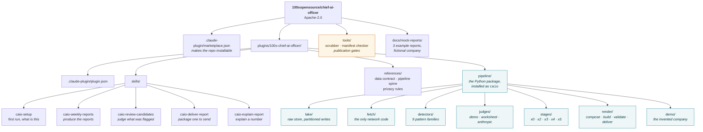
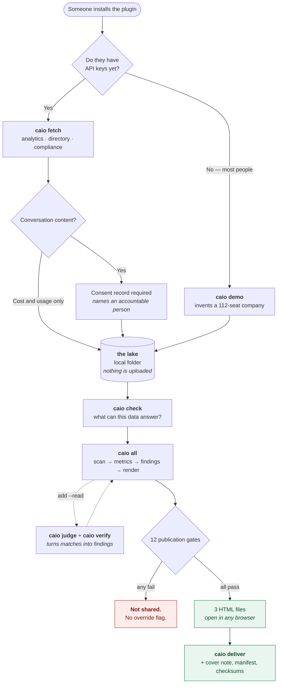
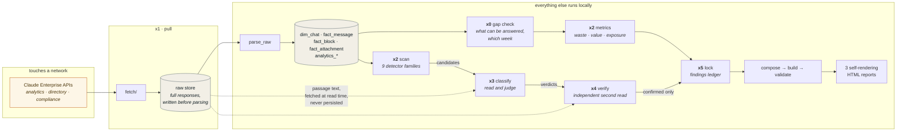
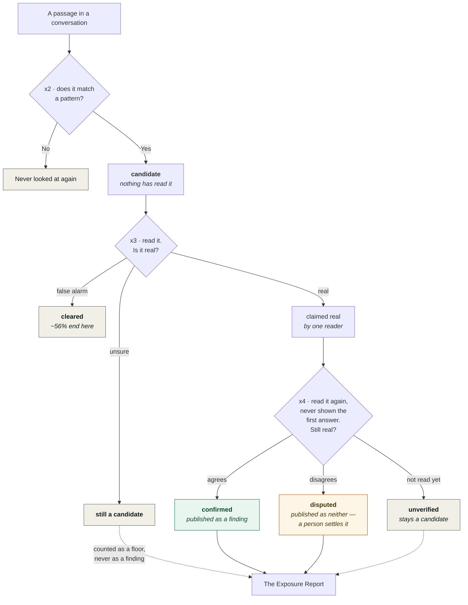

# How it fits together

Four diagrams: what ships, what a person does with it, how data moves, and the
one rule the whole thing exists to enforce.

---

## 1. What ships

Everything below installs from one repository. The pipeline is a Python package
with a `caio` command; the skills are what make it usable from Claude.

---

## 2. What a person does

Two paths in. Nobody needs credentials to see it work.

---

## 3. How data moves through the stages

The left column never talks to a network. The right column is the only part
that does.

---

## 4. The one rule

A pattern match is not a finding. This is what the two reading passes are for,
and it is the difference between a report worth sending and a number that
overstates reality by more than double.

**Who did the reading matters, and the report says so.** Three judges are
available: an offline stand-in for the demo and CI, a worksheet a person fills
in, and a model. A report whose verdicts came from the stand-in opens by saying
what share of them nobody actually read.

---

## Against OST-74

The shipping framework asked for three things:

| Asked for | State |
|---|---|
| Plugin with skills to create reports | **Done** — 5 skills, plugin and marketplace manifests, gated in CI |
| HTML reports | **Done** — 3 reports, self-rendering, 12 publication gates each |
| Claude artifact that refreshes with new data | **Not built** — reports are static HTML files today |

The third one is a real gap. A report is one file that renders itself from a
data record embedded inside it, which is what makes it safe to email and
impossible to disagree with itself — but it also means the numbers are frozen at
build time. A refreshing artifact would need somewhere live to read from, which
is a different shape from "a file you can send", and worth deciding on
deliberately rather than by default.
